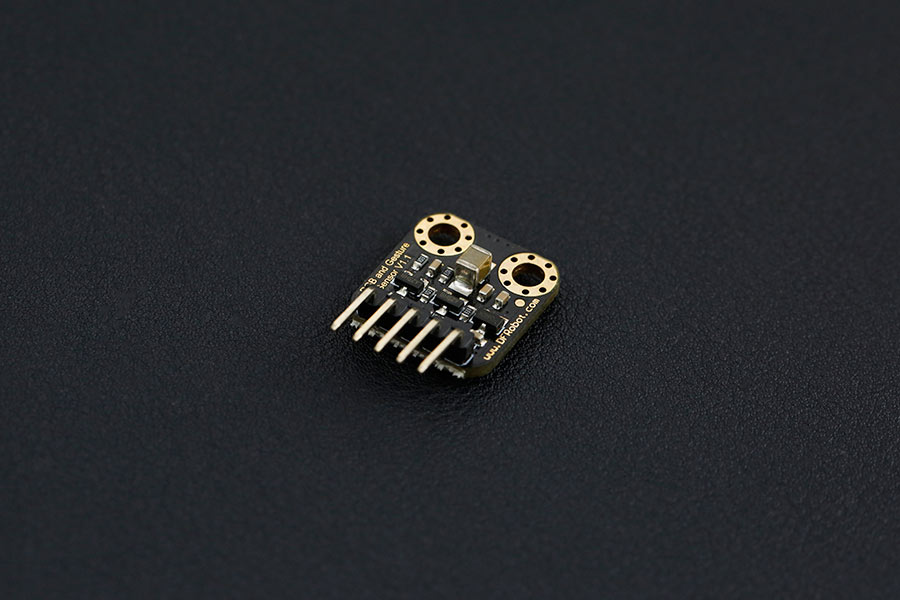

# DFRobot_APDS9960
- [English Version](./README.md)

本品是DFRobot全新推出的一款手势识别传感器，能够识别你手的运动方向（上下左右）。内置的识别算法相当智能，能够把双<br>
手从生硬的按键中解放出来。<br>
模块采用了APDS-9960传感器，这是一款集成了RGB、环境光、接近和手势检测的芯片。I2C接口保证了它的可使用性，近程和<br>
手势检测配有红外LED。环境光检测功能可在多种光条件下，以及透过多种减振材料（包括深色玻璃）的情况下，检测出光强<br>
度。此外，集成 UV-IR 遮光滤光片可实现精准的环境光和相关色温检测。<br>
作为对触屏和摄像头的补充，红外手势识别能够大大提升手机等数码设别的操作体验。被首先应用到三星S4系列的手机中。另<br>
外，特别是在医院、汽车、体感游戏等不方便用手触摸电器的场合，高效的手势识别会非常有用。<br>
应用场景<br>

智能手机、平板电脑等消费电子的交互
  * 非接触式的鼠标
  * 家庭照明系统
  * 温度系统的控制
  * 汽车电子设备的控制
  * 医院电器控制
  * 机器人的交互




## 产品链接（https://www.dfrobot.com.cn/goods-1191.html)
    SEN0187：红外手势传感器（带RGB/环境光检测）
## 目录

  * [概述](#概述)
  * [库安装](#库安装)
  * [方法](#方法)
  * [兼容性](#兼容性)
  * [历史](#历史)
  * [创作者](#创作者)

## 概述


提供Arduino库驱动RGB颜色和手势传感器

## 库安装

要使用这个库，首先下载库文件，将其粘贴到\Arduino\libraries目录中，然后打开示例文件夹并在文件夹中运行演示程序。

## 方法
```C++

    
   /**
    * @fn init
    * @brief 配置I2C通信并初始化寄存器为默认值
    * @return True 如果初始化成功. False 失败.
    */
   bool init();
    
   /**
    * @fn getMode
    * @brief 读取并返回ENABLE寄存器的内容
    * @return ENABLE寄存器的内容. 0xFF 错误.
    */
  uint8_t getMode();
    
   /**
    * @fn setMode
    * @brief 启用或禁用APDS-9960的某个功能
    * @param mode 要启用的模式
    * @param enable 打开 (1) 或者 关闭 (0)
    * @return 如果操作成功，则为True.否则false.
    */
   bool setMode(uint8_t mode, uint8_t enable);
    
   /**
    * @fn enablePower
    * @brief 启动APDS-9960上的光(R/G/B/Ambient)传感器
    * @return True 传感器正确使能. False 错误.
    */
   bool enablePower();
    
   /**
    * @fn disablePower
    * @brief 结束APDS-9960上的光传感器
    * @return True 传感器正确关闭. False 错误.
    */
   bool disablePower();
    
   /**
    * @fn enableLightSensor
    * @brief 使能光传感器
    * @param interrupts true 在高光或者低光的时候启用中断
    * @return True 正确设置. False 错误.
    */
   bool enableLightSensor(bool interrupts = false);
    
   /**
    * @fn disableLightSensor
    * @brief 禁用光传感器
    * @return True 正确设置. False 错误.
    */
   bool disableLightSensor();
    
   /**
    * @fn enableProximitySensor
    * @brief 启动APDS-9960上的接近传感器
    * @param interrupts true 启用接近中断
    * @return True 正确设置. False 错误.
    */
   bool enableProximitySensor(bool interrupts = false);
    
   /**
    * @fn disableProximitySensor
    * @brief 停止APDS-9960上的接近传感器
    * @return True 正确设置. False 错误.
    */
   bool disableProximitySensor();
    
   /**
    * @fn enableGestureSensor
    * @brief 启动APDS-9960上的手势识别
    * @param interrupts true 启用手势识别相关中断
    * @return True 正确设置. False 错误.
    */
   bool enableGestureSensor(bool interrupts = true);
    
   /**
    * @fn disableGestureSensor
    * @brief 结束APDS-9960上的手势识别
    * @return True 正确设置. False 错误.
    */
   bool disableGestureSensor();
    
   /**
    * @fn getLEDDrive
    * @brief 获取LED驱动强度和ALS
    * @n Value    LED Current
    * @n   0        100 mA
    * @n   1         50 mA
    * @n   2         25 mA
    * @n   3         12.5 mA
    * @n 
    * @return LED驱动器强度值(0-3). 0xFF 错误.
    */
   uint8_t getLEDDrive();
    
   /**
    * @fn setLEDDrive
    * @brief 设置led的驱动强度和ALS
    * @n Value    LED Current
    * @n   0        100 mA
    * @n   1         50 mA
    * @n   2         25 mA
    * @n   3         12.5 mA
    * @n 
    * @param drive LED驱动器强度值(0-3)
    * @return True 正确设置. False 错误.
    */
   bool setLEDDrive(uint8_t drive);
    
   /**
    * @fn getGestureLEDDrive
    * @brief 获取LED在手势模式下的驱动电流
    * @n Value    LED Current
    * @n   0        100 mA
    * @n   1         50 mA
    * @n   2         25 mA
    * @n   3         12.5 mA
    * @n 
    * @return ld驱动电流. 0xFF 错误.
    */
   uint8_t getGestureLEDDrive();
    
   /**
    * @fn setGestureLEDDrive
    * @brief 设置手势模式下LED驱动器电流
    * @n Value    LED Current
    * @n   0        100 mA
    * @n   1         50 mA
    * @n   2         25 mA
    * @n   3         12.5 mA
    * @n 
    * @param drive LED驱动电流的值
    * @return True 如果操作成功. False 失败.
    */
   bool setGestureLEDDrive(uint8_t drive);
    
   /**
    * @fn getAmbientLightGain
    * @brief 返回环境光传感器(ALS)的接收器增益
    * @n Value    Gain
    * @n   0        1x
    * @n   1        4x
    * @n   2       16x
    * @n   3       64x
    * @n 
    * @return 环境光传感器(ALS)的接收器增益. 0xFF 失败.
    */
   uint8_t getAmbientLightGain();
    
   /**
    * @fn setAmbientLightGain
    * @brief 设置环境光传感器(ALS)的接收增益
    * @n Value    Gain
    * @n   0        1x
    * @n   1        4x
    * @n   2       16x
    * @n   3       64x
    * @n 
    * @param drive 增益
    * @return True 操作成功. False 失败.
    */
   bool setAmbientLightGain(uint8_t gain);
    
   /**
    * @fn getProximityGain
    * @brief 返回接近检测的接收机增益
    * @n Value    Gain
    * @n   0       1x
    * @n   1       2x
    * @n   2       4x
    * @n   3       8x
    * @n 
    * @return 接近增益的值. 0xFF 失败.
    */
   uint8_t getProximityGain();
    
   /**
    * @fn setProximityGain
    * @brief 设置接近检测的接收器增益
    * @n Value    Gain
    * @n   0       1x
    * @n   1       2x
    * @n   2       4x
    * @n   3       8x
    * @n 
    * @param gain 增益的值(0-3)
    * @return True 操作成功. False 失败.
    */
   bool setProximityGain(uint8_t gain);
    
   /**
    * @fn getGestureGain
    * @brief 获取在手势模式下光电二极管的增益
    * @n Value    Gain
    * @n   0       1x
    * @n   1       2x
    * @n   2       4x
    * @n   3       8x
    * @n 
    * @return 二极管的增益. 0xFF  错误.
    */
   uint8_t getGestureGain();
    
   /**
    * @fn setGestureGain
    * @brief 在手势模式下设置光电二极管的增益
    * @n Value    Gain
    * @n   0       1x
    * @n   1       2x
    * @n   2       4x
    * @n   3       8x
    * @n 
    * @param gain 光电二极管增益的值
    * @return True 操作成功. False 失败.
    */
   bool setGestureGain(uint8_t gain);
    
   /**
    * @fn getLightIntLowThreshold
    * @brief 获取环境光中断的低阈值
    * @param threshold 当前存储在APDS-9960上的低阈值
    * @return True 操作成功. False 失败.
    */
   bool getLightIntLowThreshold(uint16_t &threshold);
    
   /**
    * @fn setLightIntLowThreshold
    * @brief 设置环境光中断的低阈值
    * @param threshold 中断触发的低阈值
    * @return True 操作成功. False 失败.
    */
   bool setLightIntLowThreshold(uint16_t threshold);
    
   /**
    * @fn getLightIntHighThreshold
    * @brief 获取环境光中断的高阈值
    * @param threshold 当前存储在APDS-9960上的高阈值
    * @return True 操作成功. False 失败.
    */
   bool getLightIntHighThreshold(uint16_t &threshold);
    
   /**
    * @fn setLightIntHighThreshold
    * @brief 设置环境光中断的高阈值
    * @param threshold 中断触发的高阈值
    * @return True 操作成功. False 失败.
    */
   bool setLightIntHighThreshold(uint16_t threshold);
    
   /**
    * @fn getProximityIntLowThreshold
    * @brief 获取接近传感器中断的低阈值
    * @param threshold 当前存储在APDS-9960上的低阈值
    * @return True 操作成功. False 失败.
    */
   bool getProximityIntLowThreshold(uint8_t &threshold);
    
   /**
    * @fn setProximityIntLowThreshold
    * @brief 设置接近传感器中断的低阈值
    * @param threshold 中断触发的低阈值
    * @return True 操作成功. False 失败.
    */
   bool setProximityIntLowThreshold(uint8_t threshold);
    
   /**
    * @fn getProximityIntHighThreshold
    * @brief 获取接近传感器中断的高阈值
    * @param threshold 存储在APDS-9960上的高阈值
    * @return True 操作成功. False 失败.
    */
   bool getProximityIntHighThreshold(uint8_t &threshold);
    
   /**
    * @fn setProximityIntHighThreshold
    * @brief 设置接近中断传感器的高阈值
    * @param threshold 中断触发的高阈值
    * @return True 操作成功. False 失败.
    */
   bool setProximityIntHighThreshold(uint8_t threshold);
    
   /**
    * @fn getAmbientLightIntEnable
    * @brief 获取是否启用环境光中断
    * @return 1 启用, 0 未启用. 0xFF 错误.
    */
   uint8_t getAmbientLightIntEnable();
    
   /**
    * @fn setAmbientLightIntEnable
    * @brief 打开或关闭环境光中断
    * @param enable 1 打开, 0 关闭
    * @return True 操作成功. False 失败.
    */
   bool setAmbientLightIntEnable(uint8_t enable);
    
   /**
    * @fn getProximityIntEnable
    * @brief 获取是否启用接近中断
    * @return 1 已启用, 0 未启用. 0xFF 错误.
    */
   uint8_t getProximityIntEnable();
    
   /**
    * @fn setProximityIntEnable
    * @brief 打开或关闭接近中断
    * @param enable 1 使能接近中断, 0 关闭接近中断
    * @return True 操作成功. False 失败.
    */
   bool setProximityIntEnable(uint8_t enable);
    
   /**
    * @fn getGestureIntEnable
    * @brief 获取是否启用手势中断
    * @return 1 已启用, 0 未启用. 0xFF 错误.
    */
   uint8_t getGestureIntEnable();
    
   /**
    * @fn setGestureIntEnable
    * @brief 打开或关闭与手势相关的中断
    * @param enable 1 使能中断, 0 关闭中断
    * @return True 操作成功. False 失败.
    */
   bool setGestureIntEnable(uint8_t enable);
    
   /**
    * @fn clearAmbientLightInt
    * @brief 清除环境光中断
    * @return True 操作成功. False 失败.
    */
   bool clearAmbientLightInt();
    
   /**
    * @fn clearProximityInt
    * @brief清除接近中断
    * @return True 操作成功. False 失败.
    */
   bool clearProximityInt();
    
   /**
    * @fn readAmbientLight
    * @brief 读取16位值的环境光等级
    * @param val 光传感器的值.
    * @return True 操作成功. False 失败.
    */
   bool readAmbientLight(uint16_t &val);
    
   /**
    * @fn readRedLight
    * @brief 读取16位值的红灯级别
    * @param val 光传感器的值.
    * @return True 操作成功. False 失败.
    */
   bool readRedLight(uint16_t &val);
    
   /**
    * @fn readGreenLight
    * @brief 读取16位值的绿灯级别
    * @param val 光传感器的值.
    * @return True 操作成功. False 失败.
    */
   bool readGreenLight(uint16_t &val);
    
   /**
    * @fn readBlueLight
    * @brief 读取16位值的蓝灯级别
    * @param val 光传感器的值.
    * @return True 操作成功. False 失败.
    */
   bool readBlueLight(uint16_t &val);
    
    /**
    * @fn readProximity
    * @brief 将接近传感器级别读取为8位值
    * @param val接近传感器的值.
    * @return True 操作成功. False 失败.
    */
   bool readProximity(uint8_t &val);
    
   /**
    * @fn isGestureAvailable
    * @brief 判断是否有可用于读取的手势
    * @return True 有. False 没有.
    */
   bool isGestureAvailable();
    
   /**
    * @fn readGesture
    * @brief 处理一个手势事件并返回最佳猜测的手势
    * @return 与手势对应的数字.-1 错误.
    */
   int readGesture();
```

## 兼容性

MCU                | Work Well    | Work Wrong   | Untested    | Remarks
------------------ | :----------: | :----------: | :---------: | -----
Arduino Uno        |      √       |              |             | 
FireBeetle-ESP8266        |      √       |              |             | 
FireBeetle-ESP32        |      √       |              |             | 
Arduino MEGA2560        |      √       |              |             | 
Arduino Leonardo|      √       |              |             | 
Micro:bit        |      √       |              |             | 
FireBeetle-M0        |      √       |              |             | 
Raspberry Pi      |      √       |              |             | 


## 历史

- 2020/07/02 - Version 1.0.0 released.

## 创作者

Written by fengli(li.feng@dfrobot.com), 2021.7.2 (Welcome to our [website](https://www.dfrobot.com/))


